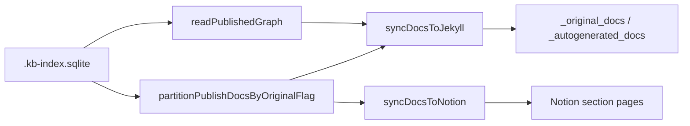

# Publish

Export the SQLite knowledge base to external sinks. Publish reads **active** docs from `.kb-index.sqlite` — it does not re-run init or LLM synthesis. Both sinks use wipe-and-replace: lane contents are cleared, then rewritten; items no longer in SQLite are removed.

## Role in the stack



Facts drive Q&A; documents are publish-facing artifacts (see [`../facts-architecture.md`](../facts-architecture.md)). Graph export is Jekyll-only today.

## Core pieces

| File | Role |
|---|---|
| `publish-docs.ts` | Shared doc row type + lane split |
| `jekyll-sync.ts` | Wipe lane `.md`; write front matter + graph artifacts |
| `notion-sync.ts` | Archive section children; recreate doc pages |
| `publish-state.ts` | Notion container/section IDs (`.kb-publish-notion.json`) |
| `graph-reader.ts` | Facts → graph payload |
| `cli/publish-cli.ts` / `publish-jekyll.ts` | Command entrypoints |

## Integration

```bash
kb publish jekyll [--base <name>] [--dir <jekyll-root>] [--apply]
kb publish notion [--base <name>] [--parent-page-id <id>] [--apply]
```

Lanes: `is_original === 1` → originals; else autogenerated. CLI defaults to preview; pass `--apply` to write (TUI auto-applies — see [`../../cli/CLI.md`](../../cli/CLI.md)). Notion needs `notion.token` + `notion.parentPageId`. Jekyll layout: [`../../../docs/JEKYLL.md`](../../../docs/JEKYLL.md).

## Sync semantics

1. Load publishable docs (`listPublishableDocs`).
2. Preview: return `written`, `removed`, `skipped` without mutating the sink.
3. Apply: wipe each lane, write current docs.

Jekyll deletes lane `.md` files before writing. Notion archives section child pages (IDs in `.kb-publish-notion.json`).

## Invariants

- Read SQLite only — never publish from disk markdown directly.
- Keep the lane split identical in Jekyll and Notion.
- Apply must remove stale sink entries absent from the current doc set.
- Skip empty titles; record in `skipped`.
- Do not hand-edit generated Jekyll lane files.

## Extension checklist

- [ ] Route new lanes in `publish-docs.ts`, then both sync modules.
- [ ] Mirror preview/apply/removed/skipped shape for new sinks.
- [ ] Add `tests/core/` + `tests/cli/` coverage.

## Gotchas

- Title renames change Jekyll filenames; old files drop on apply.
- Notion removal matches page title within a section.
- First Notion publish creates `{baseName} — KB Publish` under the parent page.
- Empty SQLite + `--apply` clears published lane content.

## Related docs

- [`../../cli/CLI.md`](../../cli/CLI.md)
- [`../facts-architecture.md`](../facts-architecture.md)
- [`../../../docs/JEKYLL.md`](../../../docs/JEKYLL.md)
