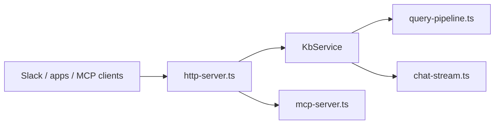

# KB HTTP, MCP, and Slack Server

Runs `kb` as a **central, long-lived HTTP service** so indexing happens once on durable storage and clients call REST (and optionally MCP / Slack) instead of re-bootstrapping a CLI per request. Entry point: `kb server start [--with-mcp] [--with-slack]`.

## Role in the stack



**Boundaries:** No git sync on each request (`runQueryPipeline` is stateless). Reindex is explicit (`POST /v1/reindex`) or scheduled (`KB_REINDEX_INTERVAL`). Server reindex uses incremental auto-sync semantics: every tracked repo is polled, but only repos with new commits are re-indexed. Chat history is **in-memory** per `sessionId`; restart clears sessions.

## Core pieces

| File | Role |
|---|---|
| `server-cli.ts` | `kb server start`; boot-build; scheduler; shutdown; logs startup event |
| `kb-service.ts` | Query, chat, readFacts, reindex, health |
| `http-server.ts` | `/healthz`, `/v1/*`, optional `POST /mcp`, optional `POST /slack/events`; per-request tracing |
| `logger.ts` | Structured JSON logger — `LOG_LEVEL`-gated, one JSON line per event to stdout |
| `query-pipeline.ts` | Shared retrieval + synthesis with CLI |
| `chat-stream.ts` | `runChatSynthesis` → SSE |
| `mcp-server.ts` | Streamable HTTP MCP handler |
| `reindex-scheduler.ts` | `KB_REINDEX_INTERVAL` |

## Integration

- **CLI:** `src/cli/index.ts` → `runServerCommand`.
- **Boot-build:** missing `.kb-index.sqlite` → `kb init` or `kb scan` before `listen()`.
- **Docker:** `server start --with-mcp` in Dockerfile CMD; Slack is enabled by `KB_SERVER_ENABLE_SLACK=true`.
- **Dev:** `pnpm run server:start` for a local process; `pnpm run server:up` for the guided Docker path.
- **Observability:** Every request emits a `request` line on entry and a `response` line on finish (`status`, `durationMs`), both keyed by a UUID `requestId` also returned as the `x-request-id` response header. Each route adds semantic logs: query/chat/reindex/mcp emit start/complete/error with timings; `/healthz` logs at `debug`; auth failures and unknown routes log at `warn`. Control verbosity via `LOG_LEVEL` (`debug|info|warn|error`; default `info`). Set in `.env` / `docker-compose.yml` `LOG_LEVEL` env var.

### MCP clients (Claude Code & Cursor Agent)

Start the server with MCP enabled (same `KB_SERVER_API_KEY` on server and client):

```bash
export KB_SERVER_API_KEY=testkey
kb server start --with-mcp
```

**Claude Code** — Streamable HTTP at `POST /mcp`:

```bash
claude mcp add --transport http -s user kb http://localhost:8080/mcp \
  --header "Authorization: Bearer ${KB_SERVER_API_KEY}"
```

Use your deploy URL instead of `localhost` for a remote server. Verify with `claude mcp list`.

**Cursor Agent** — add to `~/.cursor/mcp.json` (project scope: `.cursor/mcp.json`), then use the Agent CLI:

```bash
mkdir -p ~/.cursor
cat > ~/.cursor/mcp.json <<'EOF'
{
  "mcpServers": {
    "kb": {
      "url": "http://localhost:8080/mcp",
      "headers": {
        "Authorization": "Bearer testkey"
      }
    }
  }
}
EOF

agent mcp list
agent mcp list-tools kb
```

Replace `testkey` / the URL when pointing at a deployed instance. If `mcp.json` already exists, merge the `kb` entry under `mcpServers` instead of overwriting.

**Tools exposed:** `kb_query`, `read_facts`, `search_code_symbols`, `get_code_neighbors`, `get_code_graph_summary`.

### Endpoints (`kb server start [--with-mcp] [--with-slack]`)

| Method / path | Auth | Purpose |
|---|---|---|
| `GET /healthz` | none | Liveness + `indexMtime` + `reindexing` |
| `POST /v1/query` | Bearer | Synthesized answer + sources |
| `POST /v1/chat` | Bearer | Multi-turn SSE chat |
| `POST /v1/reindex` | Bearer | Incremental rescan |
| `POST /mcp` | Bearer | MCP Streamable HTTP when `--with-mcp` |
| `POST /slack/events` | Slack HMAC | Slack Events API webhook (when Slack mode is enabled) |

Auth: `Authorization: Bearer <KB_SERVER_API_KEY>` or `X-Api-Key`.

### Slack integration (`KB_SERVER_ENABLE_SLACK` + secrets)

Set Slack mode plus both secrets to enable the webhook route:

```bash
export KB_SERVER_ENABLE_SLACK=true
export SLACK_SIGNING_SECRET=<from Slack app config>
export SLACK_BOT_TOKEN=xoxb-<bot token>
kb server start --with-slack
```

Configure your Slack app's **Event Subscriptions** URL to `https://<your-host>/slack/events` and subscribe to:
- `app_mention` — bot @-mentioned in a channel

**Routing:**
- `app_mention` → one synthesized `service.query({ synthesize: true })` call using the mention text with the bot mention stripped
- replies are posted back to Slack in the same thread (`thread_ts ?? event.ts`)

Bot-posted events (`bot_id` or `subtype`) are silently ignored to prevent reply loops. Slack retries are deduplicated by `event_id`.

## Invariants

- Retrieval via `runQueryPipeline` or `streamChatTurn` only.
- `reindex` is single-flight (`isReindexing()`).
- MCP HTTP is stateless — fresh server + transport per request.
- Boot-build completes before `listen()`.

## Extension checklist

1. Route in `http-server.ts` → add to `server.http` (or `slack.http` for Slack routes) + `openapi.yaml` + `tests/server/`.
2. Log `start`/`complete`/`error` in the new handler using `log` from `./logger.js`, keyed by `ctx.requestId`.
3. Changeset for `src/` / `bin/` changes.

## Gotchas

- Chat SSE may fall back from Gemini stream to non-streaming.
- REST `synthesize` defaults true; MCP `kb_query` defaults false.

## Related docs

[`packages/kb-server/http/HTTP.md`](packages/kb-server/http/HTTP.md) · [`packages/kb-server/INTEGRATION_TEST.md`](packages/kb-server/INTEGRATION_TEST.md) · [`../core/QUERY_INTERNALS.md`](../core/QUERY_INTERNALS.md)
