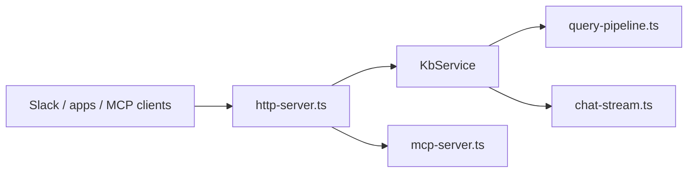

# KB HTTP and MCP Server

Runs `kb` as a **central, long-lived HTTP service** so indexing happens once on durable storage and clients call REST (and optionally MCP) instead of re-bootstrapping a CLI per request. Entry point: `kb server start [--with-mcp]`.

## Role in the stack

**Boundaries:** No git sync on each request (`runQueryPipeline` is stateless). Reindex is explicit (`POST /v1/reindex`) or scheduled (`KB_REINDEX_INTERVAL`). Chat history is **in-memory** per `sessionId`; restart clears sessions.

## Core pieces

| File | Role |
|---|---|
| `server-cli.ts` | `kb server start`; boot-build; scheduler; shutdown |
| `kb-service.ts` | Query, chat, readFacts, reindex, health |
| `http-server.ts` | `/healthz`, `/v1/*`, optional `POST /mcp` |
| `query-pipeline.ts` | Shared retrieval + synthesis with CLI |
| `chat-stream.ts` | `runChatSynthesis` → SSE |
| `mcp-server.ts` | Streamable HTTP MCP handler |
| `reindex-scheduler.ts` | `KB_REINDEX_INTERVAL` |

## Integration

- **CLI:** `src/cli/index.ts` → `runServerCommand`.
- **Boot-build:** missing `.kb-index.sqlite` → `kb init` or `kb scan` before `listen()`.
- **Docker:** `server start --with-mcp` in Dockerfile CMD.
- **Dev:** `pnpm run server:start|stop`.

### Endpoints (`kb server start [--with-mcp]`)

| Method / path | Auth | Purpose |
|---|---|---|
| `GET /healthz` | none | Liveness + `indexMtime` |
| `POST /v1/query` | Bearer | Synthesized answer + sources |
| `POST /v1/chat` | Bearer | Multi-turn SSE chat |
| `POST /v1/reindex` | Bearer | Incremental rescan |
| `POST /mcp` | Bearer | MCP Streamable HTTP when `--with-mcp` |

Auth: `Authorization: Bearer <KB_SERVER_API_KEY>` or `X-Api-Key`.

## Invariants

- Retrieval via `runQueryPipeline` or `streamChatTurn` only.
- `reindex` is single-flight (`isReindexing()`).
- MCP HTTP is stateless — fresh server + transport per request.
- Boot-build completes before `listen()`.

## Extension checklist

1. Route in `http-server.ts` → `server.http` + `openapi.yaml` + `tests/server/`.
2. Changeset for `src/` / `bin/` changes.

## Gotchas

- Chat SSE may fall back from Gemini stream to non-streaming.
- REST `synthesize` defaults true; MCP `kb_query` defaults false.

## Related docs

[`packages/kb-server/http/HTTP.md`](packages/kb-server/http/HTTP.md) · [`packages/kb-server/INTEGRATION_TEST.md`](packages/kb-server/INTEGRATION_TEST.md) · [`../core/QUERY_INTERNALS.md`](../core/QUERY_INTERNALS.md)
