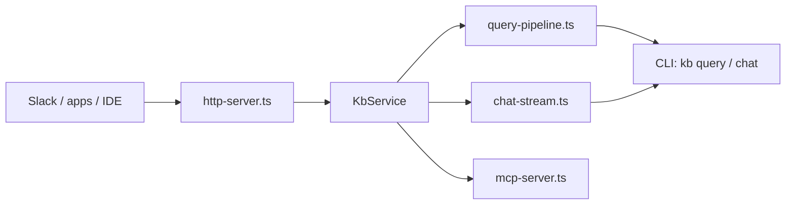

# KB HTTP and MCP Server

Runs `kb` as a **central, long-lived service** so indexing happens once on durable storage and clients call HTTP or MCP instead of re-bootstrapping a CLI per request. `kb server start` and `kb mcp start` share one `KbService` built at boot.

## Role in the stack

**Boundaries:** Server code does not own git sync on each request (`runQueryPipeline` is stateless — no `maybeAutoSync`). Reindex is explicit (`POST /v1/reindex`) or scheduled (`KB_REINDEX_INTERVAL`). Chat history is **in-memory** per `sessionId` (`session-store.ts`); restart clears sessions.

## Core pieces

| File | Role |
|---|---|
| `server-cli.ts` | `kb server start` / `kb mcp start`; boot-build index; scheduler + shutdown |
| `kb-service.ts` | Single in-process service: query, chat, readFacts, reindex, health |
| `http-server.ts` | `node:http` routes — `/healthz`, `/v1/*`, optional `POST /mcp` |
| `query-pipeline.ts` | Shared retrieval + synthesis with CLI (`runQueryTruthRetrieval`) |
| `chat-stream.ts` | Bridges `runChatSynthesis` to SSE `ChatEvent` stream |
| `mcp-server.ts` / `mcp-tools.ts` | stdio + Streamable HTTP MCP; `kb_query`, `read_facts` |
| `reindex-scheduler.ts` | `KB_REINDEX_INTERVAL` → `service.reindex` |
| `serialize.ts` | REST/MCP query result shape |

## Integration

- **CLI dispatch:** `src/cli/index.ts` → `runServerCommand` / `runMcpCommand`.
- **Boot-build:** `ensureIndexBuilt()` — missing index → `kb init` (`KB_GIT_REPOS`) or `kb scan` (`meta.json`). Listens only after index exists.
- **Docker / deploy:** [`../../docs/DEPLOY_CLOUD_RUN.md`](../../docs/DEPLOY_CLOUD_RUN.md). **Dev:** `pnpm run server:start|stop`, `mcp:start|stop`.

### Endpoints (`kb server start [--mcp]`)

| Method / path | Auth | Purpose |
|---|---|---|
| `GET /healthz` | none | Liveness; includes `indexMtime` when index on disk |
| `POST /v1/query` | Bearer | Synthesized answer + sources (default `synthesize: true`) |
| `POST /v1/chat` | Bearer | Multi-turn chat over SSE (`sessionId` + `message`) |
| `POST /v1/reindex` | Bearer | Incremental rescan (single writer guard) |
| `POST /mcp` | Bearer | MCP Streamable HTTP when `--mcp` or `mcp start --http` |

Auth: `Authorization: Bearer <KB_SERVER_API_KEY>` or `X-Api-Key`. Comma-separated keys in env for rotation. Empty key → startup warning and open `/v1` + `/mcp`.

## Invariants

- All retrieval must flow through `runQueryPipeline` or `streamChatTurn` — no parallel server-only routers.
- `reindex` must not run concurrently; `isReindexing()` guards overlapping calls.
- stdio MCP must log to **stderr** only — stdout is JSON-RPC.
- MCP HTTP uses a **fresh** server + transport per request (no session affinity).
- Boot-build completes before `listen()`; health probes must allow `start_period` on first clone+index.

## Extension checklist

1. Route in `http-server.ts` → `server.http` + `openapi.yaml` + `tests/server/`.
2. Changeset for `src/server/` or `bin/` changes.

## Gotchas

- Chat SSE may 503 on Gemini stream and fall back to non-streaming.
- REST `synthesize` defaults true; MCP `kb_query` defaults false.
- Cloud Run: single instance + NFS/Filestore for SQLite.

## Related docs

[`../../http/HTTP.md`](../../http/HTTP.md) · [`../../scripts/INTEGRATION_TEST.md`](../../scripts/INTEGRATION_TEST.md) · [`../core/QUERY_INTERNALS.md`](../core/QUERY_INTERNALS.md)
