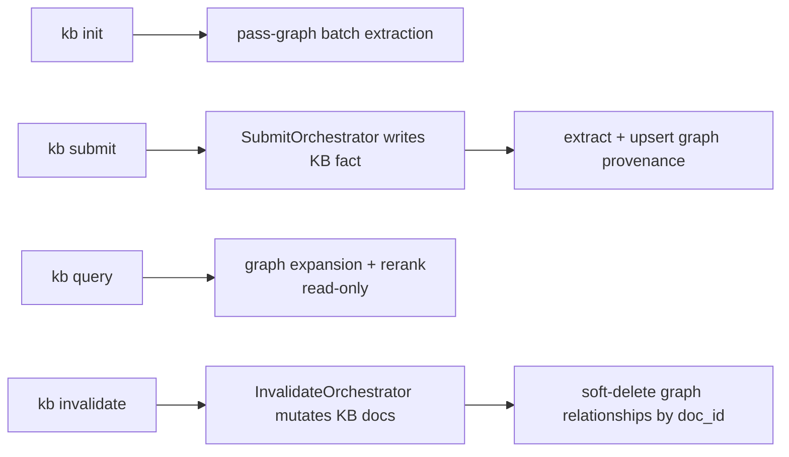
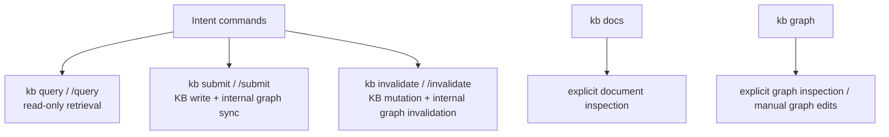

# Knowledge Graph

KB maintains a property graph alongside its SQLite document store. The graph tracks concepts, systems, tools, decisions, and people as **entities**, connected by typed **relationships** (e.g. `uses`, `depends_on`, `implements`).

## What it does for you

As you build up your knowledge base, the graph gives you a structural view of how ideas connect — something the flat SQLite full-text index cannot express.

**Navigation:** You can ask "what does X depend on?" or "what implements Y?" by name, without writing a query.

**Path finding:** "How is A related to B?" runs a shortest-path traversal over the graph, surfacing non-obvious connections across documents.

**Query expansion:** Graph neighbors of a query term are added as synonyms before hitting the document index, improving recall when exact phrasing differs between a query and a stored fact.

**Export:** The full graph can be dumped as Graphviz DOT (for visualisation tools like Gephi or Mermaid) or JSON (for your own analysis).

**Manual curation:** You can add nodes, descriptions, and directed edges from the CLI (dry-run by default, `--apply` to commit). Automated extraction from `kb submit` / `kb init` merges with hand-authored graph data in the same DuckDB file.

**Session override:** Pass `--base <name>` on `kb graph` (same as other KB commands) to target a specific session without switching your active base.

## Storage

The graph lives at `<base-dir>/.kb-graph.duckdb` — a DuckDB database file next to the SQLite document index.

Graph extraction, query expansion, and retrieval-time graph ranking are always on when the DuckDB graph file exists (created by `kb init` pass-graph or graph tools). Optional tuning env vars (`KB_GRAPH_RANKING_WEIGHT`, `KB_GRAPH_RANKING_MAX_BOOST`) only adjust ranking weights, not whether the graph participates.

Schema:

```sql
entities       — id, name, type, doc_id, description, created_at
relationships  — id, from_id, to_id, type, doc_id, weight, created_at
```

- `type` on entities: `concept | system | tool | decision | person`
- `type` on relationships: canonical extractor labels (`depends_on`, `contradicts`, `related_to`, `replaces`, `implements`, `uses`) **or** any snake_case label you set via `kb graph edge add --verb` (free text is normalized to snake_case for storage)
- `weight`: 1.0 for live edges, 0 for soft-deleted edges (set by `kb invalidate`)
- DuckPGQ property graph (`kb_graph`) is created on open when the extension is available; recursive CTEs handle traversal as a fallback.

## How it stays up to date



| Trigger | What happens |
|---|---|
| `kb submit "<fact>"` | `SubmitOrchestrator` writes the KB fact, then extracts and upserts graph entities + relationships when graph mode is enabled |
| `kb invalidate "<old>"` | All edges whose `doc_id` matches the affected documents are soft-deleted (weight → 0) |
| `kb init` — `pass-graph` cycle | LLM runs batch extraction over all finalized documents written to SQLite |

## CLI

```
kb graph                          # Summary: entity count, relationship count, top nodes by connections
kb graph --entity <name>          # Outgoing + incoming edges for a named entity
kb graph --path <from> <to>       # Shortest path between two entities (max 6 hops)
kb graph --format dot             # Export as Graphviz DOT to stdout
kb graph --format json            # Export full graph as JSON to stdout

# Edits (dry-run until you add --apply — see TUI.md / AGENTS.md mutation safety)
kb graph node add --name "..." [--id ...] [--type concept|system|tool|decision|person] [--description "..."] [--doc-id ...] [--apply]
kb graph node set --entity <id-or-name> [--name "..."] [--description "..."] [--type ...] [--apply]
kb graph edge add --from <id-or-name> --to <id-or-name> --verb "<label>" [--doc-id ...] [--apply]
kb graph edge remove --from ... --to ... --verb ... [--apply]
```

## Graph-augmented query

When a graph-enabled lookup runs (`kb query` and `kb chat`), the graph is consulted before the document index:

1. The query terms are slugified and looked up as entity IDs.
2. For every live edge touching those entities, expansion adds **semantic triplets** as natural-language phrases (`Subject <predicate phrase> Object`, plus the stored predicate slug and a spaced variant, e.g. `retrieves_via` and `retrieves via`) and then **neighbor entity names** (same star neighborhood as before).
3. The expanded term set is capped and concatenated to the original query for full-text and hybrid retrieval.
4. On **hybrid** hits, graph reranking attaches **typed edge hints** (entity names plus stored relationship `type`, e.g. `one-hop:kb-query-[retrieves_via]->MarkdownDocumentReader`) to top results; query/chat **answer enrichment** includes those hints in the LLM context so prose answers can reflect real edges when they align with document text.

This means a query for "DuckGraphWriter" will also surface documents mentioning "DuckDB" or "property graph" if those edges exist in the graph — even if those terms don't appear literally in the query.

## Surface ownership



## Implementation

| File | Role |
|---|---|
| `src/tools/duck-graph-writer.ts` | DuckDB schema, upsert, soft-delete, traversal, export |
| `src/tools/graph-entity-extractor.ts` | LLM-based entity + relationship extraction from text |
| `src/cli/graph-cli.ts` | `kb graph` command parsing and output formatting |
| `src/tools/submit-orchestrator.ts` | KB write orchestration plus graph extraction/upsert |
| `src/tools/invalidate-orchestrator.ts` | KB invalidation orchestration plus graph provenance cleanup |
| `src/cli/init-cli.ts` | `pass-graph` cycle in `kb init` |
