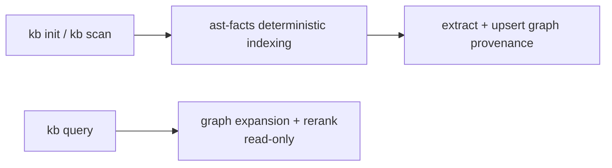
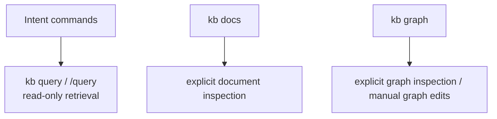

# Knowledge Graph

KB maintains a property graph alongside its SQLite document store. The graph tracks concepts, systems, tools, decisions, and people as **entities**, connected by typed **relationships** (e.g. `uses`, `depends_on`, `implements`).

## What it does for you

As you build up your knowledge base, the graph gives you a structural view of how ideas connect — something the flat SQLite full-text index cannot express.

**Navigation:** You can ask "what does X depend on?" or "what implements Y?" by name, without writing a query.

**Path finding:** "How is A related to B?" runs a shortest-path traversal over the graph, surfacing non-obvious connections across documents.

**Query expansion:** `expandQueryWithGraph()` (`src/tools/graph-query-expansion.ts`) appends related symbol and fact terms to the query string before **`read_facts`**. See § Graph-augmented query below.

**Export:** The full graph can be dumped as Graphviz DOT (for visualisation tools like Gephi or Mermaid) or JSON (for your own analysis).

**Manual curation:** You can add nodes, descriptions, and directed edges from the CLI (preview by default, `--apply` to commit). Automated extraction from `kb init` / `kb scan` merges with hand-authored graph data in the same SQLite database as the document index.

**Session override:** Pass `--base <name>` on `kb graph` (same as other KB commands) to target a specific session without switching your active base.

## Storage

All graph data lives in **`<base-dir>/.kb-index.sqlite`** alongside documents and facts. There is one unified graph — no separate semantic entity tables.

Graph mode is enabled by default. You can disable graph extraction and graph-augmented lookup with either:

- `graph.enabled: false` in `~/.kb/config.json`
- `KB_GRAPH=false` as a one-off environment override

The code-fact graph uses the shared **`facts`** table (`source_kind='import_code'`) and **`fact_edges`** for all structural edges.

## How it stays up to date



| Trigger | What happens |
|---|---|
| `kb init` / `kb scan` — `ast-facts` cycle | Deterministic code graph indexing writes into `facts` + `fact_edges`; semantic graph is built incrementally from source |

## CLI

```
kb graph                          # Summary: entity count, relationship count, top nodes by connections
kb graph --entity <name>          # Outgoing + incoming edges for a named entity
kb graph --path <from> <to>       # Shortest path between two entities (max 6 hops)
kb graph --format dot             # Export as Graphviz DOT to stdout
kb graph --format json            # Export full graph as JSON to stdout

# Edits (dry-run until you add --apply — see TUI.md / AGENTS.md mutation safety)
kb graph node add --name "..." [--id ...] [--type concept|system|tool|decision|person] [--description "..."] [--doc-id ...] [--apply]
kb graph node set --entity <id-or-name> [--name "..."] [--description "..."] [--type ...] [--apply]
kb graph edge add --from <id-or-name> --to <id-or-name> --verb "<label>" [--doc-id ...] [--apply]
kb graph edge remove --from ... --to ... --verb ... [--apply]
```

## Graph-augmented query

`expandQueryWithGraph()` runs in `index.ts` and `chat-cli.ts` before the `query_truth` envelope reaches **`read_facts`**. It widens the query string (code-graph FTS + 1-hop `fact_edges`, then LIKE on `facts.subject`/`object`; capped at 26 appended terms). Post-retrieval, `rerankByGraphConnectivity()` may re-score results.

Separate from `query-expander.ts` (LLM paraphrases inside the deep **`FactsDocumentReader`** path).

## Surface ownership



## Code graph

The `code-graph` cycle runs during `kb init` and `kb scan` — no LLM. It indexes source files deterministically and writes into `facts` (`source_kind='import_code'`) and `fact_edges` (structural edge types: `IMPORTS_FILE`, `EXPORTS_SYMBOL`, `EXTENDS`, `IMPLEMENTS`). Per-file content hashes enable incremental skip on re-run.

### Language support

- **TypeScript / JavaScript** — `TsMorphIndexer` (type-aware; runs when `tsconfig.json` is present)
- **Tree-sitter AST** — Go, TS/TSX, JS/JSX, Python, Rust, Ruby, Java, C/C++, C#, CSS, Bash, PHP, Scala, HTML (see `LANG_CONFIGS` in `src/tools/tree-sitter-indexer.ts`; each needs a `tree-sitter-<lang>` npm package that ships `.wasm`)
- **Text / config files** (`.md`, `.yaml`, `.json`, `.toml`, etc.) — `TreeSitterIndexer` text fallback: file node only, no symbols
- Adding a new language requires one entry in `LANG_CONFIGS` + `EXT_MAP` plus a WASM-shipping `tree-sitter-<lang>` package. See [`TREE_SITTER_INDEXER.md`](TREE_SITTER_INDEXER.md) for registry and query conventions.

All WASM grammars ship as npm package assets — no native compilation, no platform-specific binaries.

## Implementation

| File | Role |
|---|---|
| `src/tools/graph-query-expansion.ts` | Pre-retrieval query widening |
| `src/tools/graph-rag-reranker.ts` | Post-retrieval graph re-rank |
| `src/tools/kb-graph-writer.ts` | Semantic graph schema in SQLite, upsert, soft-delete, traversal, export |
| `src/tools/graph-entity-extractor.ts` | LLM-based entity + relationship extraction from text |
| `src/cli/graph-cli.ts` | `kb graph` command parsing and output formatting |
| `src/cli/init-cli.ts` | `ast-facts` cycle in `kb init` / `kb scan` |
| `src/tools/code-graph-indexer.ts` | `TsMorphIndexer` — TS/JS AST indexing via ts-morph |
| `src/tools/tree-sitter-indexer.ts` | `TreeSitterIndexer` — multi-language AST indexing via web-tree-sitter |
| `src/tools/code-graph-store.ts` | Read-only queries over `facts`/`fact_edges` including `expandWithCodeNeighbors` |
